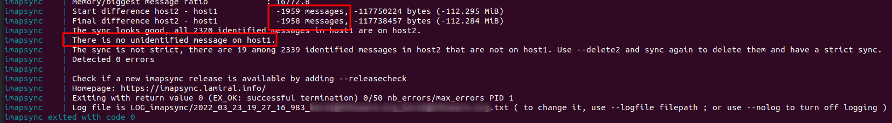

# imapsync
(without a long list of command line options)

This repository hosts a docker-compose configuration that will help you move your mail away from google by only editing a few variables.
We use [imapsync](https://imapsync.lamiral.info/) which is a great tool for the job but a little complicated to use without help.

To make it simpler we pre-configured all the necessary options, all you have left to do is copy the file `env.example` to `.env` and input the following values:

```
# Use these variables so you don't have to expose passwords.
# 
# PLEASE DELETE THESE AFTER USE!
USER1=<your e-mail - what you use to sign into google>
IMAPSYNC_PASSWORD1=<application password - see below>
USER2=<your-email>
IMAPSYNC_PASSWORD2=<password you have in our authentication system>

HOST2=mail.swarm.foundation
PORT2=993
```

## get application password for your gmail account
You need the application password because imapsync can't do 2FA, which google requires otherwise.

You can get your Gmail application password by following the steps in [getting google application password](docs/g_app_pass.md).

## Usage
Then run `# docker-compose up` This will run the container and output the results.

After that run `# docker-compose down` to remove it.

The `logs` folder contains the logs so you can look at what happened.

You can run this multiple times with no ill effect, except deleted messages on the new host will reappear.

Because gmail is wonky it will seem like there are more messages there than are transferred. This is because there are a lot of duplicates that are tagged and when accessing them via IMAP they look like the same message in different folders.



You can run the sync multiple times, it will only transfer the new messages and will NOT delete the messages that were deleted on the side of Google. If you want that, add the option `--delete2` to your docker-compose.yml. WARNING! This will delete mail that was possibly delivered to your new mailbox, so handle with care. Ask if you're not sure.


## WARNING
When you are done you **HAVE TO** remove the `.env` file which contains your passwords.

