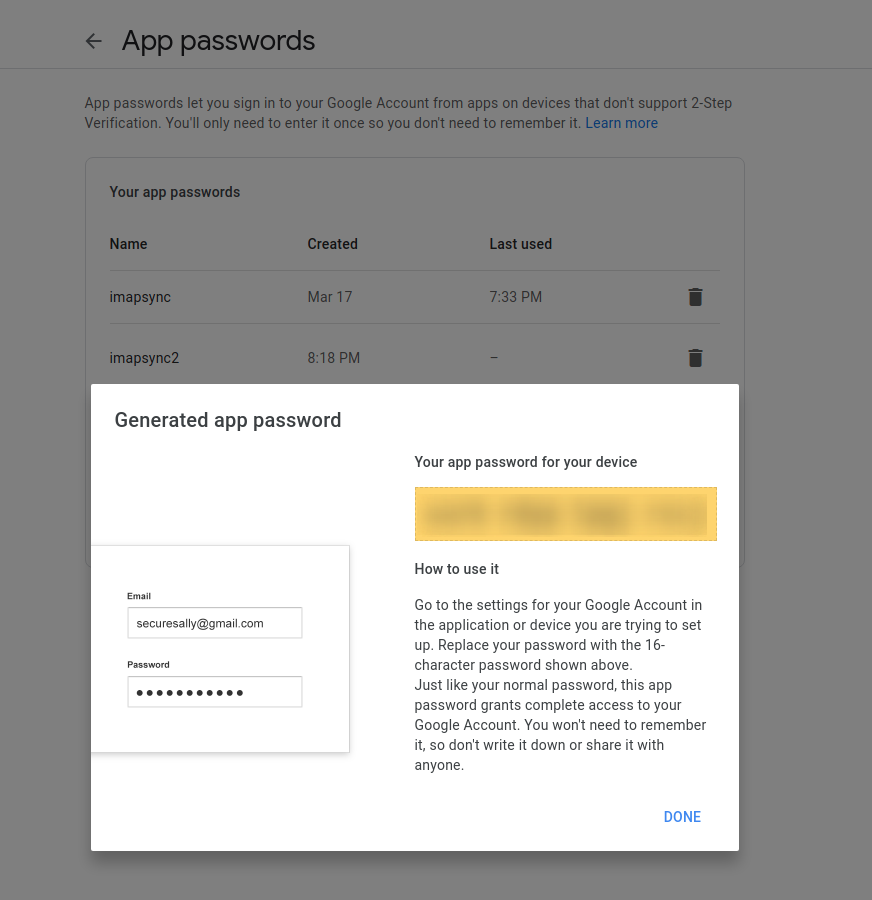

# How to get application password on Google

Go to [your account -> app password](https://myaccount.google.com/apppasswords).

Select the app `Mail` and device `Other`. Name it whatever you want (f.i. `imapsync`)

Write the password in the yellow field (without spaces) into `.env` file or securely send it to the person helping you to transfer the mail.

After the mail transfer is done, you can remove the app password so it's useless if it falls into the wrong hands.

